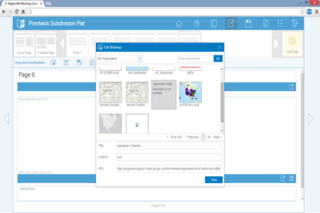

# Livres Cartographiques

Le générateur de "Livres Cartographiques" est une application ArcGIS JavaScript qui permet aux utilisateurs de construire une présentation exposant des contenus interatifs dont des cartes web ArcGIS Online (ou Portal for ArcGIS).

Cette application peut être déployée par toutes les organisations pour publier des documents dynamiques et interactifs pour les décideurs, vos collaborateurs, vos partenaires ou même le grand public. 

Les Livres Cartographiques peuvent contenir des cartes web ArcGIS, des videos, des photos, des textes riches. Vos Livres Cartographiques sont stockés sur la plateforme ArcGIS Online (ou Portal for ArcGIS) de votre organisation. Comme avec n'mporte quelle autre ressource de votre portail, vos livres cartographiques peuvent être privés, partagés avec différents membres de votre organisation ou patagés publiquement. Vos livres cartographiques s'affichent dans un navigateur aussi bien sur des postes Desktop que sur des tablettes.

Le projet "Livre Cartographique" est une version française du projet d'Esri ["Briefing-book"](https://github.com/Esri/briefing-book) traduite et adaptée par Gaëtan LAVENU (Esri France).

[Consulter un exemple de Livre Cartographique](http://195.154.180.110/LivreCartographique/default.htm)

## Fonctionnalités

* Créer une présentation incluant des cartes web ArcGIS, des vidéos, des photos et des textes riches
* Partager votre présentation avec différents utilisateurs ou de manière publique 

## Instructions

### Aide générale sur l'utilisation de GitHub (en anglais)
[New to Github? Get started here.](http://htmlpreview.github.com/?https://github.com/Esri/esri.github.com/blob/master/help/esri-getting-to-know-github.html)

## Démarrer avec ce configurateur

Pour commencer, vous devez installer et paramétrer l'application:

[Configurer l'application (reste à traduire)](http://solutions.arcgis.com/local-government/help/briefing-book/get-started/configure-application/)

[Publier l'application (reste à traduire)](http://solutions.arcgis.com/local-government/help/briefing-book/get-started/publish-application/)

## Contributing

Esri France accepte toute proposition de contribution pouvant améliorer cette application
Please see our [guidelines for contributing](https://github.com/esri/contributing).

## Licensing

Copyright 2013 Esri / Esri France

Cette application est publiée sous licence: Apache License, Version 2.0 (the "License");
Vous ne devez pas utiliser les fichiers de ce projet en dehors des clauses de cette Licence.
Les clauses de cette licence sont détaillées ici:

   http://www.apache.org/licenses/LICENSE-2.0

Vous devez également prendre en compte les limitations suivante:

"Unless required by applicable law or agreed to in writing, software
distributed under the License is distributed on an "AS IS" BASIS,
WITHOUT WARRANTIES OR CONDITIONS OF ANY KIND, either express or implied.
See the License for the specific language governing permissions and
limitations under the License.""

Une copie des clauses de la licence Apache Version 2.0 se trouve dans ce Repository GitHub (en version originale anglaise)
[LICENSE.txt](LICENSE.txt).

